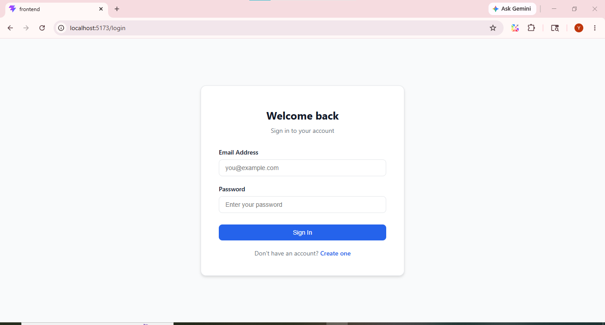
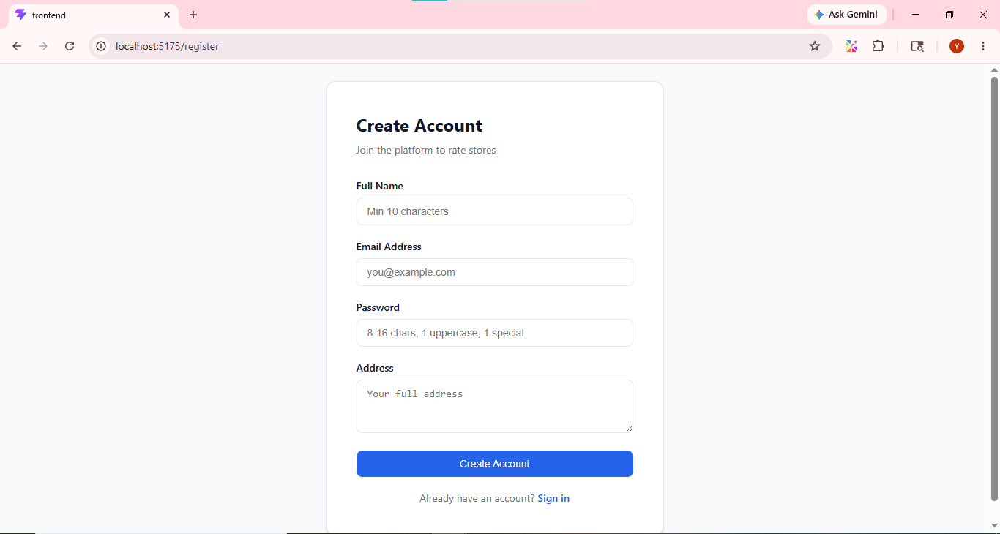
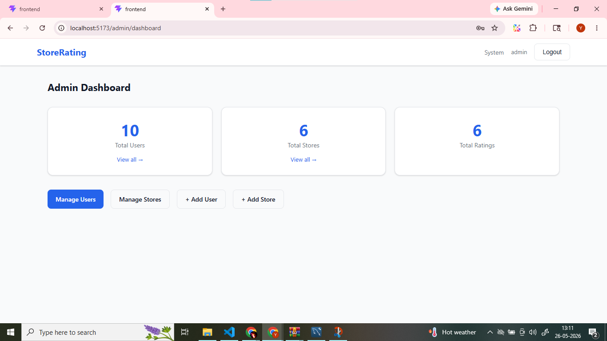
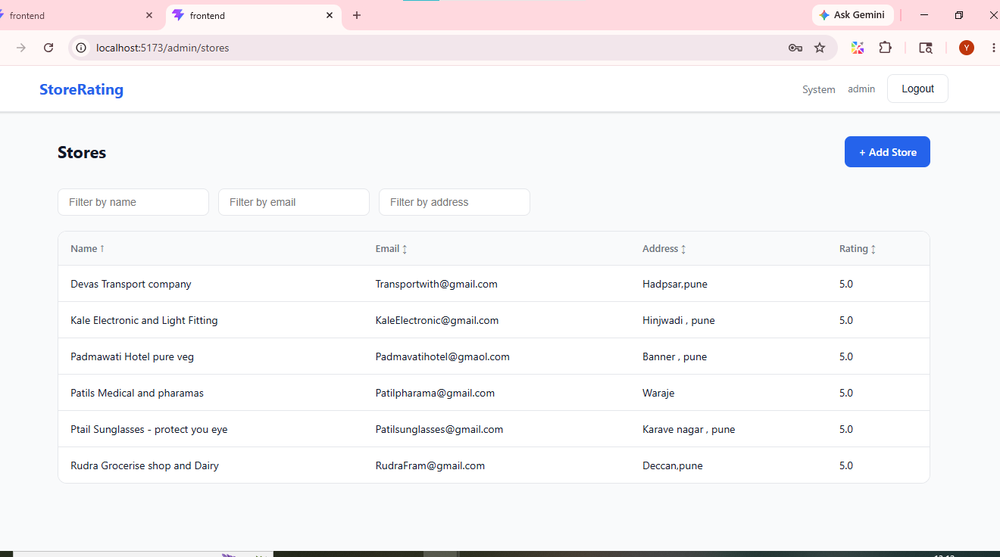
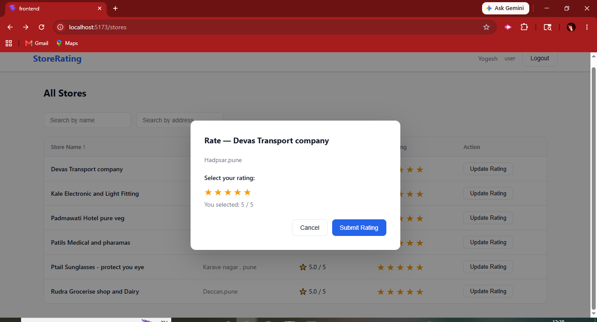
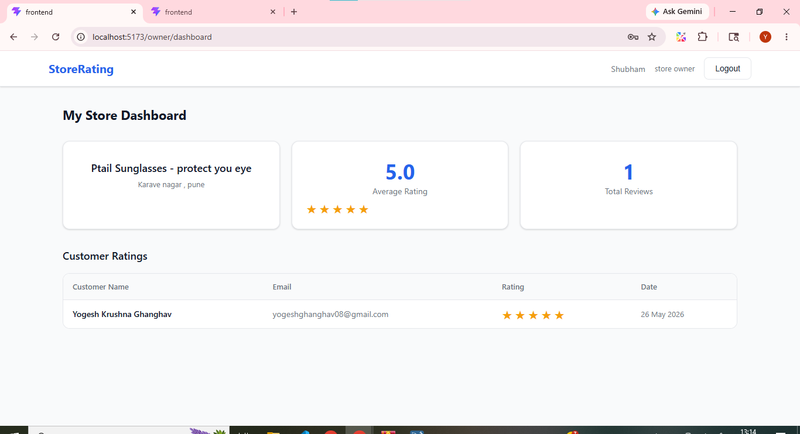

# store-rating-platform


---

# Overview

This project is developed as part of the FullStack Intern Coding Challenge.  
It is a full-stack Store Rating Platform where users can register, login, rate stores, and manage ratings based on their roles.

The platform supports:

> Authentication & Authorization  
> Role-based Access Control  
> Store Rating System  
> Admin Dashboard  
> Store Owner Dashboard  
> Protected Routes  
> Full Frontend + Backend Integration

---

# Tech Stack

## Frontend
- React.js (Vite)
- React Router DOM
- Axios
- CSS

## Backend
- Node.js
- Express.js
- MySQL
- JWT Authentication
- bcryptjs
- REST APIs

---

# User Roles

## 1. System Administrator
- Manage stores
- Manage users
- View dashboard statistics
- Apply filters and sorting
- View ratings

## 2. Normal User
- Register & Login
- View stores
- Search stores
- Submit ratings
- Modify ratings

## 3. Store Owner
- Login
- View users who rated their store
- Check average store rating

---

# Authentication Flow

```text
User Login/Register
        |
 Server Validation
        |
 JWT Token Generated
        |
 Token Stored in localStorage
        |
 Protected Route Access
```

---

# Folder Structure

```text
store-rating-app/
│
├── backend/
│   ├── src/
│   │   ├── config/
│   │   │   ├── db.js
│   │   │   └── schema.sql
│   │   ├── controllers/
│   │   │   ├── authController.js
│   │   │   ├── adminController.js
│   │   │   ├── storeController.js
│   │   │   └── ownerController.js
│   │   ├── middleware/
│   │   │   └── auth.js
│   │   ├── routes/
│   │   │   └── index.js
│   │   └── index.js
│   ├── .env
│   └── package.json
│
└── frontend/
    ├── src/
    │   ├── components/
    │   │   ├── Navbar.jsx
    │   │   ├── StarRating.jsx
    │   │   └── ProtectedRoute.jsx
    │   ├── context/
    │   │   └── AuthContext.jsx
    │   ├── pages/
    │   │   ├── Login.jsx
    │   │   ├── Register.jsx
    │   │   ├── AdminDashboard.jsx
    │   │   ├── AdminUsers.jsx
    │   │   ├── AdminStores.jsx
    │   │   ├── AddUser.jsx
    │   │   ├── AddStore.jsx
    │   │   ├── StoresList.jsx
    │   │   ├── OwnerDashboard.jsx
    │   │   └── ChangePassword.jsx
    │   ├── utils/
    │   │   ├── api.jsx
    │   │   └── validators.jsx
    │   ├── App.jsx
    │   └── index.jsx
    ├── index.html
    ├── vite.config.js
    └── package.json
```

---

# Features

## Admin Features
✔ Add Stores  
✔ Add Users (Normal User, Admin, Store Owner)  
✔ View Dashboard Statistics  
✔ View All Ratings  
✔ Filter Users & Stores by Name, Email, Address, Role  
✔ Sorting (Ascending / Descending)  

## User Features
✔ Signup & Login  
✔ View All Stores  
✔ Search Stores by Name & Address  
✔ Submit Ratings (1–5 stars)  
✔ Update Previously Submitted Ratings  

## Store Owner Features
✔ Login  
✔ View Average Rating of their Store  
✔ View List of Users Who Rated their Store  

---

# Form Validations

- **Name:** Min 20 characters, Max 60 characters
- **Address:** Max 400 characters
- **Password:** 8–16 characters, at least 1 uppercase letter and 1 special character
- **Email:** Standard email validation

---

# Database Setup

Open MySQL and run the schema file:

```bash
source backend/src/config/schema.sql
```

This will create the database, all tables, and a default admin user.

**Default Admin Credentials:**
```
Email:    admin@storerating.com
Password: password
```

---

# Backend Setup

```bash
cd backend
npm install
```

Create `.env` file:

```env
PORT=5000
DB_HOST=localhost
DB_USER=root
DB_PASSWORD=your_mysql_password
DB_NAME=store_rating_db
JWT_SECRET=your_secret_key
```

Start the server:

```bash
node src/index.js
```

Runs on: `http://localhost:5000`

---

# Frontend Setup

```bash
cd frontend
npm install
npm run dev
```

Runs on: `http://localhost:5173`

---

# API Endpoints

## Authentication

| Method | Endpoint | Description |
|--------|----------|-------------|
| POST | /api/auth/register | Register new user |
| POST | /api/auth/login | Login user |
| PUT | /api/auth/update-password | Update password |

## Admin APIs

| Method | Endpoint | Description |
|--------|----------|-------------|
| GET | /api/admin/dashboard | Dashboard stats |
| GET | /api/admin/users | List all users |
| POST | /api/admin/users | Add new user |
| GET | /api/admin/stores | List all stores |
| POST | /api/admin/stores | Add new store |

## Store APIs

| Method | Endpoint | Description |
|--------|----------|-------------|
| GET | /api/stores | Get all stores with ratings |
| POST | /api/ratings | Submit or update rating |

## Store Owner APIs

| Method | Endpoint | Description |
|--------|----------|-------------|
| GET | /api/owner/dashboard | Owner dashboard data |

---

# Demo Flow

1. Login as Admin → View Dashboard  
2. Add a Store Owner user  
3. Add a Store and assign the owner  
4. Register as Normal User  
5. Browse Stores → Submit Rating  
6. Modify Rating  
7. Login as Store Owner → View ratings  
8. Logout  

---

# Screenshots

### Login Page


### Register Page


### Admin Dashboard


### Store Listing


### Submit Rating


### Store Owner Dashboard


---

# Author

Developed by Yogesh Ghanghav

---
